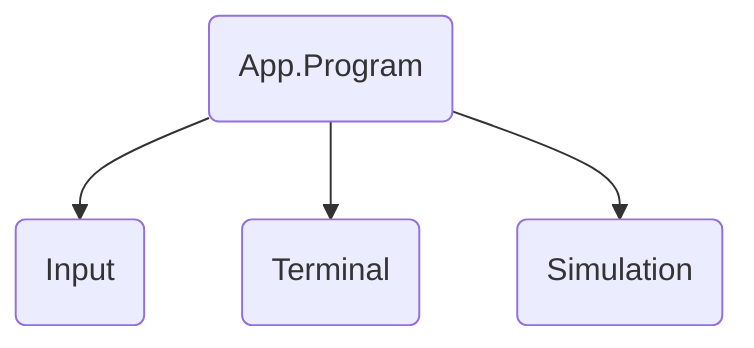

# Responsibilities

Core
- World state
- Simulation (systems)

Myrmidon.App
- Screens
- Menus
- HUD
- Inventory UI
- Game loop
- State transitions

App.Input
- Input

App.Render
- SDL3-CS
- Terminal buffer
- Rendering

- Basic widgets and drawing primitives

